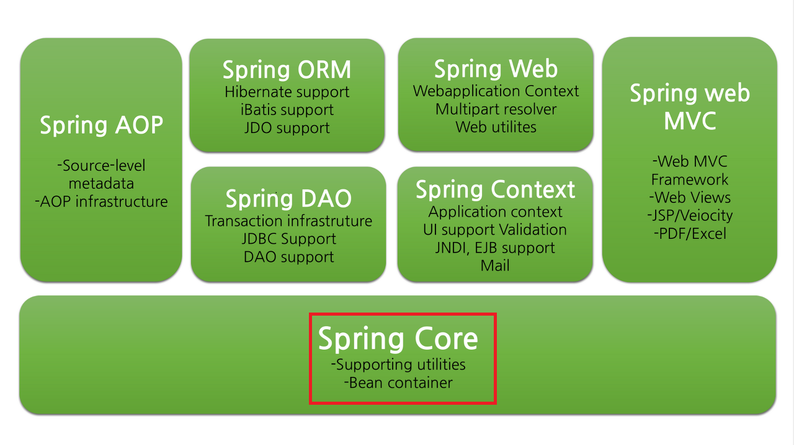
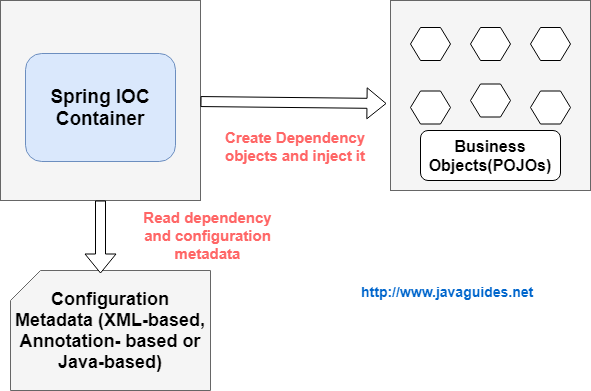
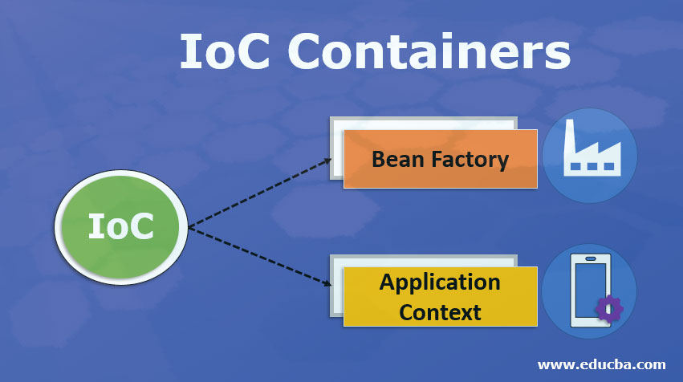
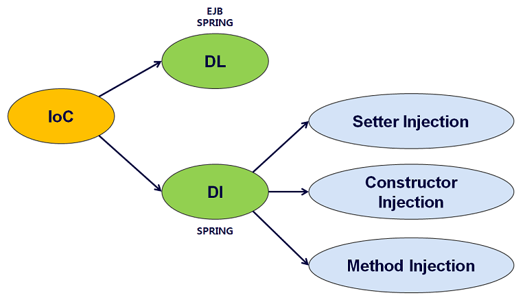

# DI

|-|
|-|
|[참고](https://www.essential2189.dev/node-di)|


IOC(Inversion of Control)
---
```
IOC는 "Inversion of Control"의 약어로, 한국어로는 "제어의 역전"이라고 번역됩니다.

IOC는 소프트웨어 디자인 패턴 중 하나로, 프로그램의 제어 흐름을 개발자가 직접 제어하는 것이 아니라,
외부에서 제어하는 패턴을 말합니다. 이는 일반적으로 객체 지향 프로그래밍에서 사용되는데, 객체 간의 의존성을
외부로부터 주입받아서 런타임 시에 객체 간의 관계를 설정하는 것을 의미합니다.
이것이 의존성 주입(Dependency Injection)의 핵심 개념이며,
Spring Framework에서 IOC 컨테이너를 통해 이러한 제어의 역전을 구현합니다.
```
DI
---
> Dependency injection <br>

> > 객체를 직접 생성하는 게 아니라 외부에서 생성한 후 주입 시켜주는 방식<br>


|-|-|-|
|-|-|-|
|관련모듈||[바로가기](https://workshop-6349.tistory.com/entry/Spring-Core-Spring-Core-%EC%84%A4%EB%AA%85)|
|IOC||[바로가기](https://jisooo.tistory.com/entry/Spring-%EA%B8%B0%EC%B4%88-Spring-framework%EC%97%90%EC%84%9C%EC%9D%98-IoC-DI-%EB%84%A4%EC%9D%B4%EB%B2%84-%EB%B8%94%EB%A1%9C%EA%B7%B8)|
|IOC||[바로가기](https://velog.io/@ddclub12/Spring%EC%9D%98-IOC%EB%9E%80-%EB%AC%B4%EC%97%87%EC%9D%B8%EA%B0%80)|
|DI||[바로가기](https://m.blog.naver.com/PostView.naver?isHttpsRedirect=true&blogId=wwwkang8&logNo=220985550237)|


실습
---
> com.example.app.domain.common.dto.PersonDto.java <br>

```
//@Getter
//@Setter
//@ToString
@Data
@Builder
@NoArgsConstructor
@AllArgsConstructor
public class PersonDto {
	private String name;
	private int age;
	private String addr;	

}
```


> com.example.app.domain.common.dto.PersonComponentDto.java <br>

```
@Component 
@Data
@NoArgsConstructor
@AllArgsConstructor
public class PersonComponentDto {
	private String name;
	private int age;
	private String addr;	
}
```

>com.example.app.config.PersonBeanConfig.java <br>

```
@Configuration
public class PersonBeanConfig {
	
	@Bean
	public PersonDto personDto3() {
		return PersonDto.builder().name("NANANA").age(55).addr("울산").build();
	}
	@Bean(name = "personhoho")
	public PersonDto personDto4() {
		return PersonDto.builder().name("YAYA").age(55).addr("기기").build();
	}
	
}
```

> root-context.xml 추가

```
	<bean id="personDto2" class="com.example.app.domain.common.dto.PersonDto">
		<constructor-arg name="name" value="hohoho"  />
		<constructor-arg name="age" value="2" />
		<constructor-arg name="addr" value="inchon" />
	</bean> 
	<context:component-scan base-package="com.example.app.config" />
	<context:component-scan base-package="com.example.app.domain.common.dto" />

```

> src/test/java ex01_Parameter.lombok.Di.DiTests<br>

```
@RunWith(SpringJUnit4ClassRunner.class)
@ContextConfiguration("file:src/main/webapp/WEB-INF/spring/root-context.xml")
@Slf4j
public class DiTests {

	@Autowired
	private PersonDto personDto2;
	
	@Autowired
	private ApplicationContext applicationContext;
	
	@Autowired
	private PersonDto personDto3;
	
	@Autowired
	private PersonDto personhoho;
	
	@Autowired
	private PersonComponentDto personComponentDto;
	
	@Test
	public void beanTests() {
		log.info(personDto2.toString());
		log.info("applicationContext : " + applicationContext);
		log.info("getBean personDto2 : " + applicationContext.getBean("personDto2"));
		log.info(personDto3.toString());
		log.info(personhoho.toString());
		log.info(personComponentDto.toString());
	}
	
}
```
